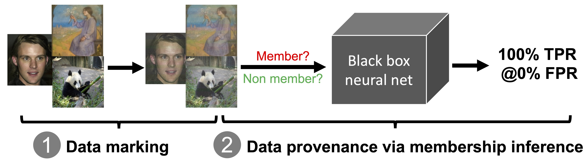

# MembershipTracker


Code for the paper "**Anonymity Unveiled: A Practical Framework for Auditing Data Use in Deep Learning Models**" in CCS'25.

MembershipTracker is a technique that enables users to accurately determine whether their data (such as personal photos) have been used to train ML models *without* permission (by means of membership inference). 




## Files
```shell
├── MembershipTracker
|    ├── train.py             # 1) train a model on target user data (marked by MembershipTracker); and 2) perform data auditing on these data  
|    ├── utils.py             # contain all the util functions
|    ├── eval.py              # perform data auditing on a trained model (this step is already included in train.py when you perform model training for the first time)
|    ├── data_marking.py      # perform data marking on data within a specified directory
|    ├── imagenet-audit.py    # perform data auditing on a pretrained ImageNet model used in our experiment
|    ├── networks             # different network architecture files
|    ├── dataset              # dataset directory
```

## Getting started

#### Installing dependencies

We tested on Debian 10 with Python 3.8.19

```
# We install torch-gpu with cuda v1.12.0, and you may change to a different download version depending on your driver version (https://pytorch.org/get-started/previous-versions/)
# We also recommend installing the dependencies via virtual env management tool, e.g., anaconda

conda create -n artifact-eval python=3.8
conda activate artifact-eval

pip install torch==1.12.0+cu116 torchvision==0.13.0+cu116 torchaudio==0.12.0 --extra-index-url https://download.pytorch.org/whl/cu116 
pip install pandas scikit-learn scipy matplotlib numpy imagehash noise

```

**Hardware**. Our experiments require dedicated GPUs for model training. Below is the configuration: AMD Ryzen Threadripper 3960X 24-Core Processor (64-bit architecture) with 48 processing units, 128GB main memory, 3 NVIDIA RTX A5000 GPUs (each with 24GB memory). 

**Datasets**. Download the dataset and unzip it under ```./dataset```. [[TinyImageNet](https://github.com/tjmoon0104/pytorch-tiny-imagenet/releases/download/tiny-imagenet-dataset/tiny-224.zip)]; [[CelebA](https://people.ece.ubc.ca/zitaoc/files/ccs25-artifact/celeba.tar)]; [[ArtBench](https://people.ece.ubc.ca/zitaoc/files/ccs25-artifact/artbench.tar)]; The CIFAR datasets will be downloaded automatically.


## Reproducing MembershipTracker's key results

Experiments (1) and (2) are described in Section 5.1, and Experiment (3) is in Section 5.3.

### (1) Single-target-user setting

```
bash single-target.sh &> R-single-target
```

The above commands evaluate MembershipTracker on different datasets, models, and training-set sizes. 

For each setting, we first train a model (where the target user's data are marked with MembershipTracker), and then perform the *set-based* membership inference on the target data for data auditing. The membership inference performance is measured in terms of FPR @ 100% TPR, and TPR @ different low FPRs.


### (2) Multi-target-user setting

```
# Format: bash multi-target.sh [num_of_target_user]

# The following exeuction considers 100 target users
bash multi-target.sh 100 &> R-multiTarget-output 
```


### (3) ImageNet experiment

Training an ImageNet model from scratch is very time-consuming, and thus we provide the pre-trained model and data from our experiment, which can be used to evaluate MembershipTracker's data auditing performance on the large-scale ImageNet setting without training a model from scratch. 

Download the data from this [[link](https://people.ece.ubc.ca/zitaoc/files/ccs25-artifact/ccs-imagenet-data.tar)] and unzip it under the main directory (```./```).

```
bash imagenet-eval.sh &> R-imagenet-eval
```

NOTE. If you do want to train a model from scratch, our paper trains a ResNet50 and Swin Transformer. The training code for these two models can be accessed at this [[link](https://github.com/pytorch/examples/tree/main/imagenet)] (from Pytorch examples) and this [[link](https://github.com/microsoft/Swin-Transformer/blob/main/get_started.md)] (from the Swin Transformer authors, and we use the config-file swin_tiny_patch4_window7_224.yaml). 

You will only have to *replace* some of the training data with the marked version using MembershipTracker (see the next section on how to perform data marking on selected data) and then perform model training. 


## Reusing MembershipTracker on other settings

The general procedure to apply MembershipTracker to other settings (e.g., a different dataset) is as follows. 

1. Perform data marking on target users' data. 
2. Train a model on a given dataset and target users' data.   
3. Perform set-based membership inference on target users' data. 

For step 1, you can place each user's data in a specific folder (e.g., ```./user_x_data, ./user_y_data```) and the perform data marking as follows. The resulting data will be saved in a new folder named ```./user_x_data_marked, ./user_y_data_marked```, etc.

```
python data_marking.py  --data_folder path_to_user_data \
                        --img_blending_ratio .7   --noise_injection_type perlin --noise_norm 8 
```

Step 2 depends on the specific training setup you have. 

To perform step 3, you can use the ```membership_inference``` function in ```util.py``` (see ```imagenet-audit.py``` for a running example). 


## Citation
If you find our work useful in your research, please consider citing: 

```
@inproceedings{chen2025MembershipTracker,
      title={Anonymity Unveiled: A Practical Framework for Auditing Data Use in Deep Learning Models}, 
      author={Chen, Zitao and Pattabiraman, Karthik},
      booktitle = {ACM SIGSAC Conference on Computer and Communications Security (CCS)},
      year={2025}
}
```

